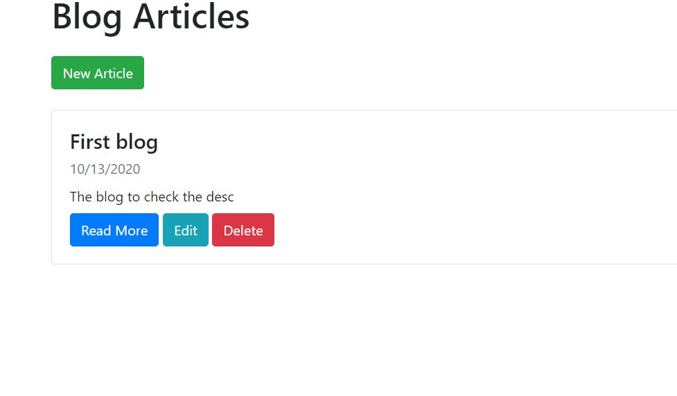
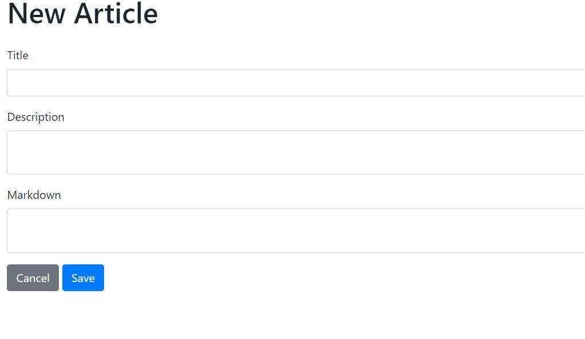

# Markdown-Blog

This is a blog website that you can use to add and customize articles.The article can be entered in a markdown format and will automatically be converted into HTML format.You can add , edit or delete the article anytime.

## Technologies used
* NodeJS
* Mongoose
* ExpressJS
* Method-override
* Bootstrap
* Slugify
* Jsdom
* Marked
* Dompurify

## Screenshots

* Main screen

* Add article screen

## Live demo
https://blog-markdown-app.herokuapp.com
